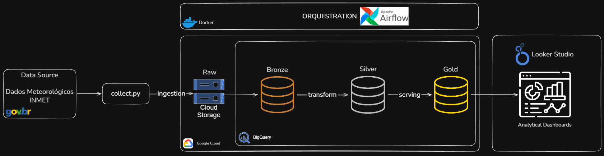

# Pipeline de Dados Climáticos

Este projeto implementa um pipeline analítico para dados meteorológicos brasileiros coletados do **INMET** (Instituto Nacional de Meteorologia), estruturado em camadas Bronze, Silver e Gold na **Google Cloud Platform**.

O objetivo é coletar e processar dados climáticos históricos brutos e estruturá-los para possibilitar análises climáticas e exploração analítica posterior.

## Etapas do Projeto
- [Arquitetura](#arquitetura)
- [Coleta de Dados](#coleta-de-dados)
- [Camada Bronze](#camada-bronze)

### Arquitetura

O pipeline segue uma arquitetura em camadas composta por ingestão, processamento e disponibilização de dados analíticos, estruturada no modelo **Medallion** (Bronze, Silver e Gold). 

A execução do pipeline é **orquestrada por DAGs**, responsáveis por coordenar as etapas das camadas de dados.

Os dados finais são disponibilizados para consumo em ferramentas de BI, permitindo a construção de relatórios e dashboards analíticos.



### Coleta de Dados

A fonte de dados deste projeto é o [Banco de Dados Meteorológicos do INMET](https://bdmep.inmet.gov.br), disponível publicamente por meio do portal oficial.

Os dados contemplam [séries históricas anuais](https://portal.inmet.gov.br/uploads/dadoshistoricos/) de estações meteorológicas distribuídas em todo o território brasileiro, abrangendo o período de 2000 até os dias atuais. Entre as principais variáveis disponíveis estão:

* Pressão atmosférica
* Radiação global
* Temperatura
* Umidade relativa do ar
* Velocidade e direção do vento

#### Estratégia de Ingestão

A coleta dos dados é realizada por meio de requisições HTTP para endpoints anuais disponibilizados pelo INMET. Cada requisição retorna um arquivo compactado (`.zip`) contendo os dados de todas as estações meteorológicas para o respectivo ano.

Exemplo de endpoint:

```
https://portal.inmet.gov.br/uploads/dadoshistoricos/{ano}.zip
```

A ingestão é orientada por **granularidade anual**, permitindo controle explícito sobre os períodos processados e facilitando reprocessamentos pontuais.

#### Camada Raw

Os arquivos `.zip` são armazenados **sem qualquer modificação** em um bucket no **Google Cloud Storage**, constituindo a camada **Raw** do pipeline.

Essa camada tem como objetivo:

* Preservar integralmente os dados de origem
* Garantir rastreabilidade
* Permitir reprocessamento completo do pipeline

O pipeline foi projetado para ser **idempotente**, evitando duplicidade de dados em reexecuções.

### Camada Bronze

A camada **Bronze** é responsável por armazenar os dados em seu formato mais próximo possível da origem, garantindo **fidelidade, rastreabilidade e possibilidade de reprocessamento**.

#### Estrutura dos Dados de Origem

Os dados provenientes do INMET são disponibilizados em arquivos compactados (`.zip`) que, ao serem descompactados, resultam em múltiplos arquivos `.csv`, cada um correspondente a uma estação meteorológica.

Cada arquivo apresenta uma estrutura não padronizada para consumo direto, composta por:

* Linhas iniciais contendo **metadados da estação** (ex: região, UF, código WMO, localização)
* Linhas subsequentes contendo as **medições meteorológicas ao longo do tempo**

#### Estratégia de Processamento na Bronze

Para viabilizar a leitura e o consumo dos dados em formato analítico, foi aplicada uma transformação mínima, mantendo o princípio de **dados quase brutos**:

* Separação dos arquivos em dois conjuntos:

  * **dados meteorológicos**
  * **metadados das estações**
* Padronização dos nomes das colunas (remoção de caracteres inválidos como `"."`)
* Remoção de colunas vazias
* Conversão dos arquivos para o formato **Parquet**

Essa abordagem preserva o conteúdo original, ao mesmo tempo em que resolve limitações técnicas de leitura e compatibilidade com ferramentas analíticas.

#### Armazenamento e Particionamento

Os dados são armazenados no **Google Cloud Storage**, organizados em estrutura de particionamento no padrão Hive, permitindo **leitura eficiente e escalabilidade**:

```
data/
    year={year}/
        station={station}/
metadata/
    year={year}/
        station={station}/    
```

* **year**: ano de referência dos dados
* **station**: identificador da estação meteorológica

Esse modelo permite:

* Processamento incremental por período
* Filtragem eficiente por partição
* Redução de custo em consultas no downstream

Os dados armazenados na Bronze são posteriormente ingeridos no **BigQuery**, onde são utilizados como base para as transformações da camada **Silver**.


### Camada Silver

A camada Silver é responsável por transformar os dados da Bronze em um formato **estruturado, consistente e confiável**, servindo como base para a construção da camada analítica.

As seguintes etapas são aplicadas aos dados meteorológicos:

* Seleção de colunas relevantes
    * Remoção de variáveis desnecessárias para as análises.

* Padronização de nomes de colunas
    * Conversão dos nomes das colunas para um padrão `snake_case`.

* Tipagem dos dados
    * Conversão dos colunas para a sua tipagem adequada.

* Padronização de datas
    * Normalização de campos de data e hora, incluindo conversão de Timezone `UTC` → `BRT`.

* Tratamento de valores nulos
    * Remoção de registros no qual TODAS as métricas meteorológicas estavam vazias.

* Remoção de duplicados
    * Verificação de possíveis registros duplicados com base na data e estação, porém não foi encontrado nenhuma ocorrência.

* Tratamento de valores inválidos
    * Identificação e tratamento de valores inconsistentes (ex: temperaturas inválidas).

Ao final dessa etapa, os dados passam a seguir um schema padronizado, permitindo uma **confiabilidade** nos dados para a execução das consultas analíticas.